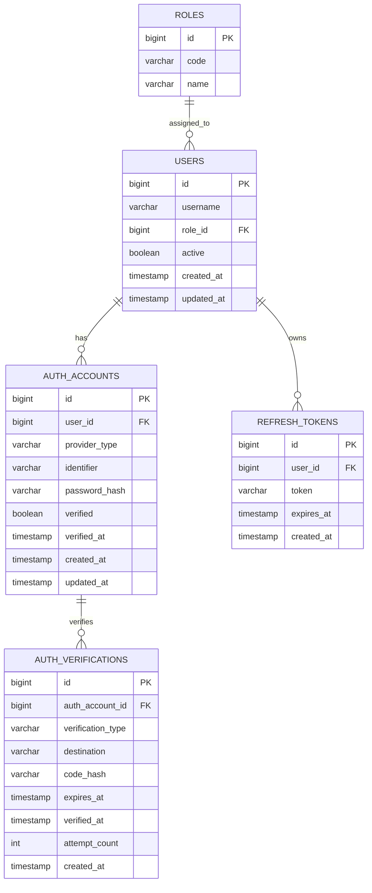

# 테이블 설계

## 목표

`users`를 이메일이나 전화번호에 묶지 않는다.

```text
users = 서비스 회원
auth_accounts = 로그인 수단
auth_verifications = 인증번호/인증링크 검증 기록
```

## ERD



## 테이블 역할

| 테이블 | 역할 |
| --- | --- |
| `users` | 서비스 안의 실제 회원 |
| `auth_accounts` | 이메일, 휴대폰, 구글 같은 로그인 수단 |
| `auth_verifications` | 이메일/SMS 인증번호 검증 기록 |
| `refresh_tokens` | JWT refresh token 세션 |
| `roles` | 회원 권한 |

## `auth_accounts` 예시

| provider_type | identifier | password_hash | verified |
| --- | --- | --- | --- |
| EMAIL | hong@example.com | bcrypt 해시 | true |
| PHONE | 01012345678 | null | true |
| GOOGLE | google-sub 값 | null | true |

권장 제약:

```sql
unique (provider_type, identifier)
```

## 왜 유연한가

이메일 가입:

```text
users.id = 1
auth_accounts.provider_type = EMAIL
auth_accounts.identifier = hong@example.com
```

SMS 가입:

```text
users.id = 1
auth_accounts.provider_type = PHONE
auth_accounts.identifier = 01012345678
```

예약 테이블은 계속 `reservations.user_id`만 보면 된다. 인증 방식이 바뀌어도 예약 도메인은 크게 바뀌지 않는다.

## 주의점

- `users.email`을 필수 컬럼으로 만들지 않는다.
- JWT subject는 이메일보다 `userId` 기준이 낫다.
- 로그인 DTO는 `email`보다 `identifier` 또는 `loginId`가 유리하다.
- 비밀번호와 인증번호는 원문 저장하지 않고 해시만 저장한다.
- SMS 인증은 만료 시간, 재시도 횟수, 재발송 제한이 필요하다.
