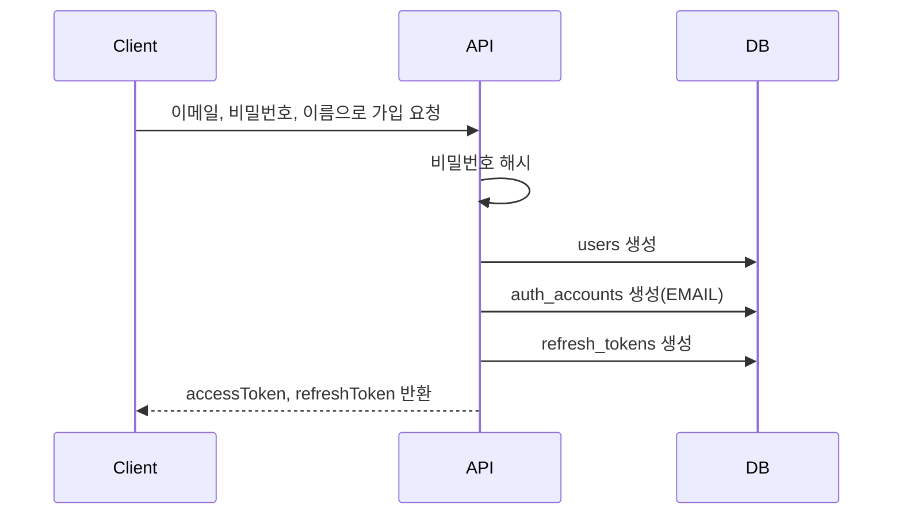
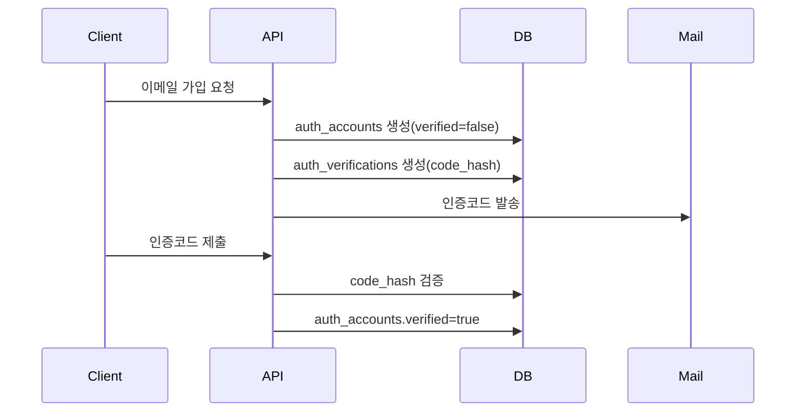
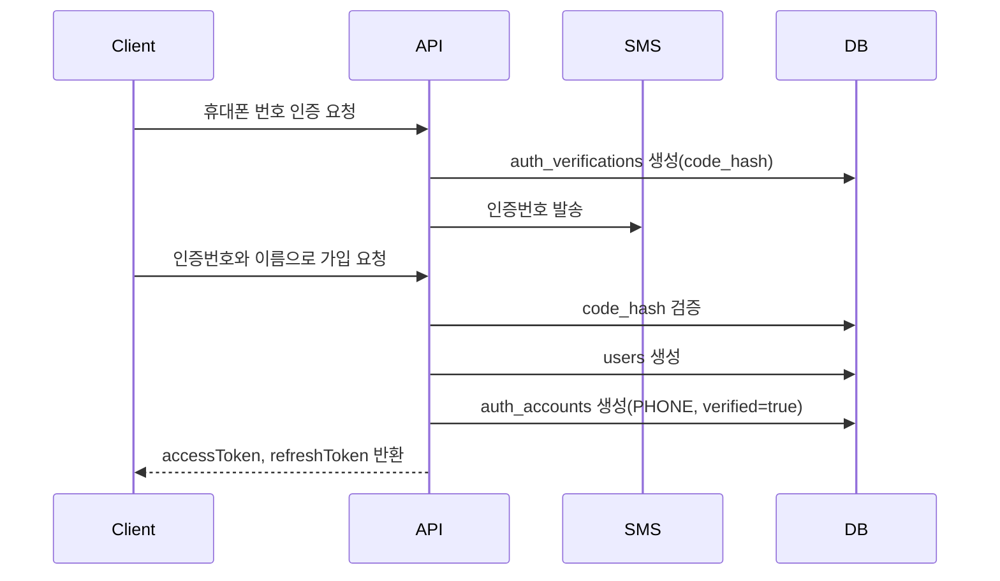

# 가입 흐름

## 이메일 가입

```mermaid
sequenceDiagram
    participant Client
    participant API
    participant DB

    Client->>API: 이메일, 비밀번호, 이름으로 가입 요청
    API->>API: 비밀번호 해시
    API->>DB: users 생성
    API->>DB: auth_accounts 생성(EMAIL)
    API->>DB: refresh_tokens 생성
    API-->>Client: accessToken, refreshToken 반환
```

## 이메일 인증 포함

```mermaid
sequenceDiagram
    participant Client
    participant API
    participant DB
    participant Mail

    Client->>API: 이메일 가입 요청
    API->>DB: auth_accounts 생성(verified=false)
    API->>DB: auth_verifications 생성(code_hash)
    API->>Mail: 인증코드 발송
    Client->>API: 인증코드 제출
    API->>DB: code_hash 검증
    API->>DB: auth_accounts.verified=true
```

## SMS 가입

```mermaid
sequenceDiagram
    participant Client
    participant API
    participant SMS
    participant DB

    Client->>API: 휴대폰 번호 인증 요청
    API->>DB: auth_verifications 생성(code_hash)
    API->>SMS: 인증번호 발송
    Client->>API: 인증번호와 이름으로 가입 요청
    API->>DB: code_hash 검증
    API->>DB: users 생성
    API->>DB: auth_accounts 생성(PHONE, verified=true)
    API-->>Client: accessToken, refreshToken 반환
```
