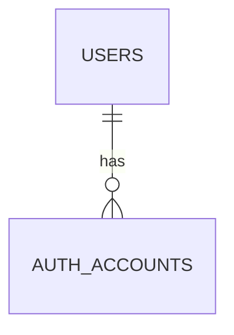

# FAQ

## 질문 0. 이메일 확인 시 비밀번호를 잠깐 DB에 비교용으로 가지고 있나?

아니다. 비밀번호 원문은 DB에 저장하지 않는다.

| 데이터 | 저장 위치 | 원문 저장 여부 | 목적 |
| --- | --- | --- | --- |
| 비밀번호 | `auth_accounts.password_hash` | 저장 안 함 | 로그인 시 비밀번호 검증 |
| 이메일 인증코드 | `auth_verifications.code_hash` | 저장 안 함 | 이메일 소유 확인 |
| 이메일 주소 | `auth_accounts.identifier` | 저장 | 로그인 식별자 |

회원가입 화면의 비밀번호 확인 입력값은 프론트 검증용이다. 서버에는 최종 비밀번호만 보내고, 서버는 해시만 저장한다.

## 질문 1. `USERS <=> AUTH_ACCOUNTS <=> AUTH_VERIFICATIONS` 구조가 더 유연한 이유는?

회원, 로그인 수단, 인증 절차가 분리되기 때문이다.

| 테이블 | 책임 |
| --- | --- |
| `users` | 서비스 안의 실제 회원 |
| `auth_accounts` | 회원이 로그인할 수 있는 수단 |
| `auth_verifications` | 이메일/SMS 인증코드 같은 일회성 본인확인 절차 |

예약, 주문, 권한은 `users.id`를 참조한다. SMS 가입으로 바뀌어도 `auth_accounts.provider_type`과 `identifier` 중심으로 바꾸면 되므로 서비스 도메인 영향이 작다.

## 질문 2. `USERS <=> AUTH_ACCOUNTS` 사이의 닭발 표시는 무슨 의미인가?

Mermaid ERD의 `||--o{`는 Crow's Foot, 즉 닭발 표기법이다.

의미는 다음과 같다.

| 표기 | 의미 |
| --- | --- |
| `||` | 정확히 1개 |
| `o` | 0개도 가능 |
| `{` | 여러 개 가능 |
| `o{` | 0개 이상 |

`USERS ||--o{ AUTH_ACCOUNTS`는 이렇게 읽는다.

- 하나의 `auth_accounts` row는 반드시 하나의 `users`에 속한다.
- 하나의 `users`는 0개 이상의 `auth_accounts`를 가질 수 있다.

실제 가입 완료 회원은 보통 최소 1개의 로그인 수단을 가진다. 다만 관리자 초대, 마이그레이션 같은 상황을 고려해 ERD에서는 `0개 이상`으로 표현할 수 있다.
