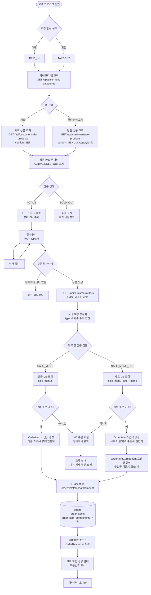
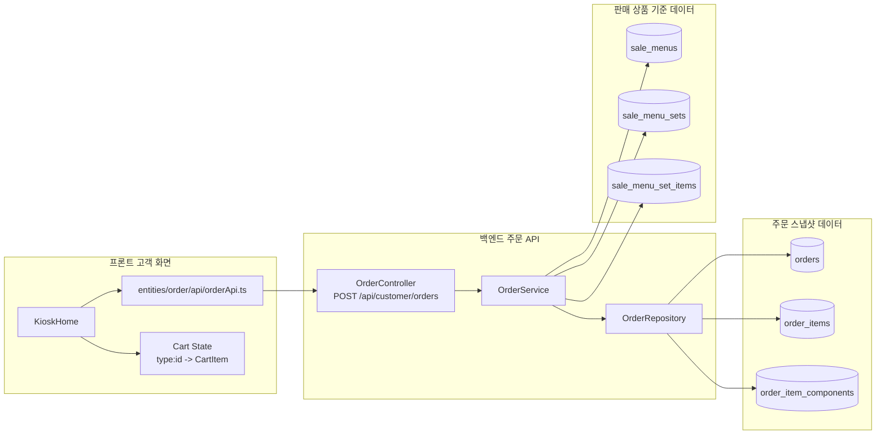
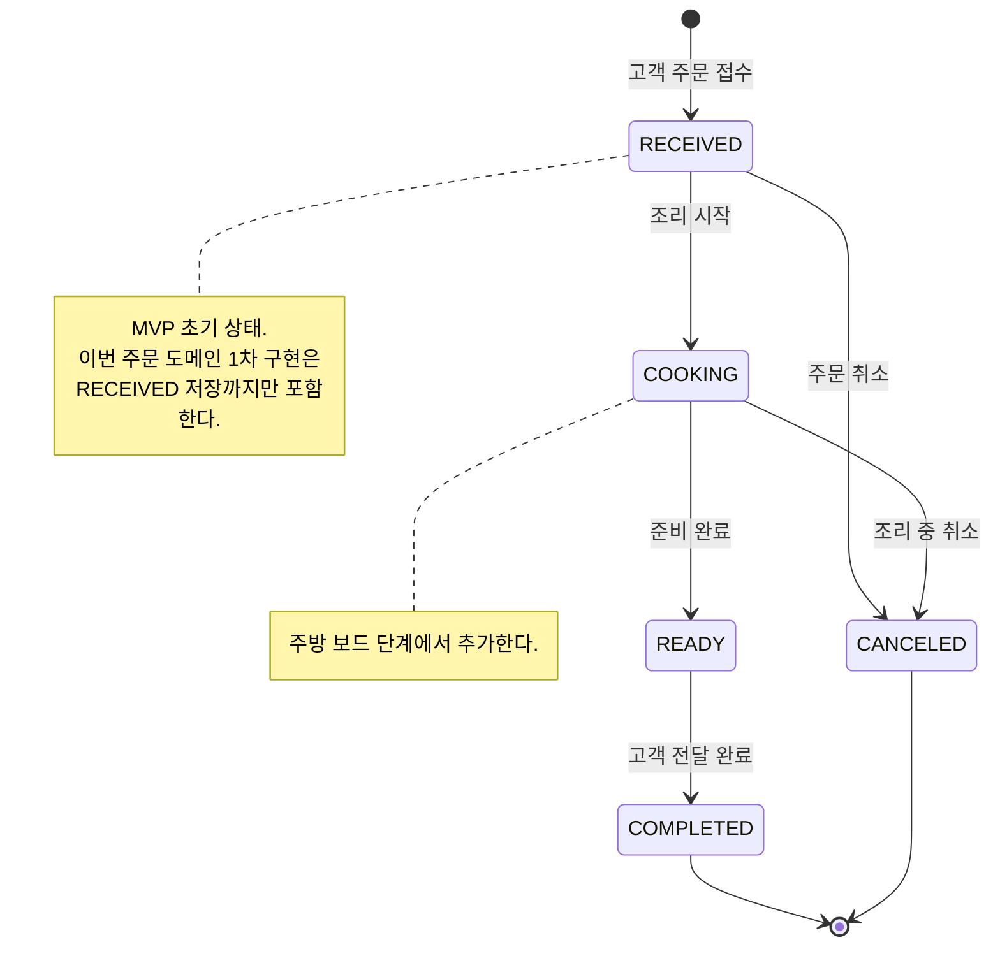

# 주문 도메인 프로세스 도식

이 문서는 GitHub에서 바로 렌더링되는 Mermaid 코드블록으로 주문 프로세스를 확인하기 위한 문서다.

원본 `.mmd` 파일:

- `주문 관련 프로세스.mmd`
- `주문 데이터 흐름.mmd`
- `주문 상태 흐름.mmd`

## 주문 관련 프로세스

```mermaid
flowchart TD
  Start([고객 키오스크 진입]) --> SelectOrderType{주문 유형 선택}
  SelectOrderType -->|매장| DineIn[DINE_IN]
  SelectOrderType -->|포장| Takeout[TAKEOUT]

  DineIn --> LoadTabs[카테고리 탭 조회\nGET /api/sale-menu-categories]
  Takeout --> LoadTabs

  LoadTabs --> SelectTab{탭 선택}
  SelectTab -->|세트| LoadSets[세트 상품 조회\nGET /api/customer/sale-products\nsection=SET]
  SelectTab -->|일반 카테고리| LoadMenus[단품 상품 조회\nGET /api/customer/sale-products\nsection=MENU&categoryId=id]

  LoadSets --> RenderProducts[상품 카드 렌더링\nACTIVE/SOLD_OUT 표시]
  LoadMenus --> RenderProducts

  RenderProducts --> ProductState{상품 상태}
  ProductState -->|ACTIVE| AddCart[카드 또는 + 클릭\n장바구니 추가]
  ProductState -->|SOLD_OUT| DisableAdd[품절 표시\n추가 비활성화]

  AddCart --> Cart[장바구니\nkey = type:id]
  Cart --> AdjustCart[수량 증감]
  AdjustCart --> Cart
  Cart --> Submit{주문 접수하기}

  Submit -->|장바구니 비어 있음| BlockSubmit[버튼 비활성화]
  Submit -->|상품 있음| CreateOrder[POST /api/customer/orders\norderType + items]

  CreateOrder --> ServerNormalize[서버 요청 정규화\ntype:id 기준 수량 합산]
  ServerNormalize --> ValidateEach{각 주문 상품 검증}

  ValidateEach -->|SALE_MENU| LoadSaleMenu[단품 DB 조회\nsale_menus]
  ValidateEach -->|SALE_MENU_SET| LoadSaleMenuSet[세트 DB 조회\nsale_menu_sets + items]

  LoadSaleMenu --> CheckMenu{단품 주문 가능?}
  CheckMenu -->|아니오| Reject[400 주문 거절\n장바구니 유지]
  CheckMenu -->|예| SnapshotMenu[OrderItem 스냅샷 생성\n이름/가격/수량/라인합계]

  LoadSaleMenuSet --> CheckSet{세트 주문 가능?}
  CheckSet -->|아니오| Reject
  CheckSet -->|예| SnapshotSet[OrderItem 스냅샷 생성\n세트 이름/가격/수량/라인합계]
  SnapshotSet --> SnapshotComponents[OrderItemComponent 스냅샷 생성\n구성품 이름/수량/순서]

  SnapshotMenu --> BuildOrder[Order 생성\norderNo/status/totalAmount]
  SnapshotComponents --> BuildOrder

  BuildOrder --> SaveOrder[(orders\norder_items\norder_item_components 저장)]
  SaveOrder --> Response[201 CREATED\nOrderResponse 반환]
  Response --> Success[고객 화면 성공 안내\n주문번호 표시]
  Success --> ClearCart[장바구니 초기화]

  Reject --> ShowError[오류 안내\n메뉴 상태 확인 요청]
```

## 주문 데이터 흐름

```mermaid
flowchart LR
  subgraph Frontend[프론트 고객 화면]
    KioskHome[KioskHome]
    OrderApi[entities/order/api/orderApi.ts]
    CartState[Cart State\ntype:id -> CartItem]
  end

  subgraph Backend[백엔드 주문 API]
    Controller[OrderController\nPOST /api/customer/orders]
    Service[OrderService]
    OrderRepo[OrderRepository]
  end

  subgraph ProductData[판매 상품 기준 데이터]
    SaleMenus[(sale_menus)]
    SaleMenuSets[(sale_menu_sets)]
    SaleMenuSetItems[(sale_menu_set_items)]
  end

  subgraph OrderData[주문 스냅샷 데이터]
    Orders[(orders)]
    OrderItems[(order_items)]
    Components[(order_item_components)]
  end

  KioskHome --> CartState
  KioskHome --> OrderApi
  OrderApi --> Controller
  Controller --> Service
  Service --> SaleMenus
  Service --> SaleMenuSets
  Service --> SaleMenuSetItems
  Service --> OrderRepo
  OrderRepo --> Orders
  OrderRepo --> OrderItems
  OrderRepo --> Components
```

## 주문 상태 흐름

```mermaid
stateDiagram-v2
  [*] --> RECEIVED: 고객 주문 접수
  RECEIVED --> COOKING: 조리 시작
  COOKING --> READY: 준비 완료
  READY --> COMPLETED: 고객 전달 완료
  RECEIVED --> CANCELED: 주문 취소
  COOKING --> CANCELED: 조리 중 취소
  COMPLETED --> [*]
  CANCELED --> [*]

  note right of RECEIVED
    MVP 초기 상태.
    이번 주문 도메인 1차 구현은
    RECEIVED 저장까지만 포함한다.
  end note

  note right of COOKING
    주방 보드 단계에서 추가한다.
  end note
```
